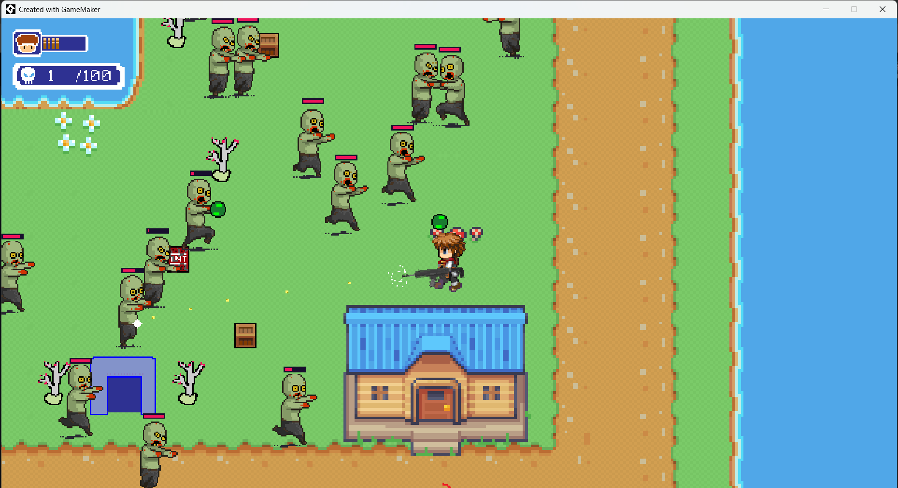

# Top-Down Shooter - Survival Zombie Siege

A 2D top-down zombie survival shooter built with GameMaker Studio 2. The player fights off waves of zombies, picks up weapons scattered around the map, and survives for as long as possible.



## About

Zombie Siege is a top-down arena shooter focused on core action-game mechanics: movement, shooting, enemy AI, collision, item pickups, and a simple game loop (start, play, die, restart).

This project was built by following the tutorial series **[How to Make a Top Down Shooter in GameMaker Studio 2! (Twin Stick Shooter)](https://www.youtube.com/playlist?list=PL14Yj-e2sgzxTXIRYH-J2_PWAZRMahfLb)** by Peyton Burnham, as a way to learn GameMaker Studio 2 (GML) fundamentals — object-oriented game logic, sprite/animation pipelines, room design, and basic game feel (hit flash, VFX, camera follow).

## Features

- Multiple weapons — pistol, shotgun, and sniper rifle, each with different fire rate, spread, and damage
- Enemy AI and spawner system — zombies spawn in waves and chase the player
- Health and damage system — player health (hearts), enemy health bars, hit-flash feedback
- Interactive environment — destructible crates, explosive (TNT) crates, weapon pickup crates
- HUD with live ammo counter, kill counter, and health display
- Camera follow system that tracks the player across the room
- Pause menu and Game Over screen with one-click restart

## Controls

| Action | Key / Input |
|---|---|
| Move | `W` `A` `S` `D` |
| Aim | Mouse |
| Shoot | Left Mouse Button |
| Pause | `Enter` |

## Tech Stack

- Engine: GameMaker Studio 2
- Language: GML (GameMaker Language)
- Art: Pixel-art sprites and tilesets

## Download & Play

Prebuilt Windows installer is available on the [Releases page](https://github.com/ardiwirya/top-down-shooter-gamemaker/releases/latest) — download and run it if you just want to play, no GameMaker installation needed.

## Getting Started (from source)

### Prerequisites
- [GameMaker Studio 2](https://gamemaker.io/en/download) installed (free tier is enough to open and run the project)

### Run the project
1. Clone this repository
   ```bash
   git clone https://github.com/ardiwirya/top-down-shooter-gamemaker.git
   ```
2. Open GameMaker Studio 2
3. Open the project file: `TOP DOWN SHOOTER/TOP DOWN SHOOTER.yyp`
4. Click Run

## Project Structure

```
TOP DOWN SHOOTER/
├── objects/     # Game objects & logic (oPlayer, oZombie, oBullet, oHUD, etc.)
├── sprites/     # Character, weapon, enemy & environment sprites
├── rooms/       # Game levels/rooms
├── scripts/     # Reusable GML scripts (weapon creation, custom functions)
├── tilesets/    # Ground/environment tilesets
├── fonts/       # UI fonts
└── TOP DOWN SHOOTER.yyp   # Main GameMaker project file
```

## Roadmap / Known Limitations

- Main menu (currently the game starts immediately on launch)
- Multiple levels / level progression
- Sound effects and background music
- Difficulty scaling / wave system tuning
- Settings menu (volume, controls)

## Credits

- Tutorial series: [How to Make a Top Down Shooter in GameMaker Studio 2! (Twin Stick Shooter)](https://www.youtube.com/playlist?list=PL14Yj-e2sgzxTXIRYH-J2_PWAZRMahfLb) by Peyton Burnham
- Built and extended by Ardi Wirya
